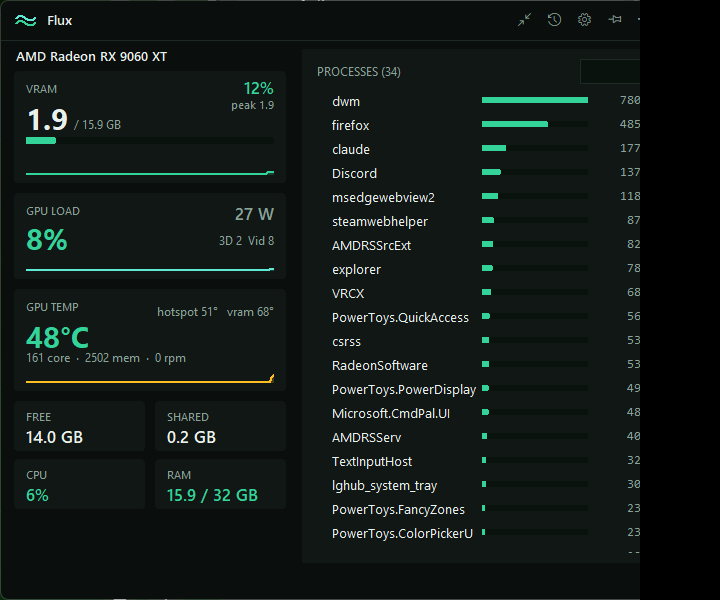

# Flux

**Flux** is a tiny GPU video-memory monitor for Windows. It shows how much VRAM
is in use, out of your card's real capacity, with live graphs and which
processes are using the memory — and lets you **end an app to free its VRAM**
right from the list.



Built on an **AMD Radeon RX 9060 XT (16 GB)** but works for any AMD / NVIDIA /
Intel GPU, because it reads the Windows WDDM GPU memory performance counters
rather than vendor-specific tools.

## Run it

**Portable exe (no Python needed):** grab **`Flux.exe`** from
[Releases](../../releases) — a single self-contained file, copy it anywhere,
no install, no admin.

**From source:**

```powershell
python vram_monitor.py
```

or double-click `Launch Flux.vbs` (runs with no console window).

**Dependencies** — the core (VRAM, GPU load, processes) is pure Python standard
library (Tkinter + ctypes). The optional **GPU temperature / clocks** card uses
`pythonnet` + LibreHardwareMonitor (bundled in the exe). It reads the AMD GPU
through the user-mode driver, so **no administrator rights are needed**; if
pythonnet or the DLLs are missing the app just hides the temp card and runs fine.

## What it shows

A frameless, custom-chrome window (drag the title bar; pin / minimise / maximise
/ close are in-app) with metric cards on the left and processes on the right:

- **VRAM card** — dedicated VRAM in use vs. true card capacity, a % that turns
  amber at 70% / red at 90%, a usage bar, a sparkline, and the **session peak**.
- **GPU load card** — live **GPU utilization %**, **power draw (W)**, the busiest
  **engines** (3D / Video / Copy / Compute), and a sparkline.
- **GPU temp card** — core temp (colour-coded), hot-spot and VRAM temps, core /
  memory clocks, fan rpm, and a temperature trend sparkline.
- **Network card** — total download / upload throughput with a dual-line trend
  graph, read off the busiest real interface so VPN / Hyper-V / WSL adapters
  don't double-count. No admin (per-process network would need ETW).
- **Free / Shared / CPU / RAM cards** — free and shared VRAM, plus CPU % and RAM.
- **Driver-cached / leak warning** — when the card reports VRAM in use that no
  live process owns (typical after closing a game), an amber line calls it out,
  notes **when** it started climbing, and reminds you **Win+Ctrl+Shift+B** flushes it.
- **Processes card** — a scrollable, **searchable** list of processes, with a
  **VRAM / CPU / RAM / NET** selector at the top that turns it into a mini task
  manager: switch between GPU memory, CPU usage (% of total), RAM (private
  working set), and per-process **network** throughput, each sorted busiest-first
  with a mini-bar, value, and a red **✕** to end the process (confirmation + a
  live identity re-check so PID reuse can't make you kill the wrong/critical
  process). An amber **↑** flags processes whose VRAM keeps climbing — the live
  leak hunter (VRAM view). The **NET** view is the one feature that needs
  administrator rights (per-process network comes from an ETW kernel trace);
  without them it offers a one-click *restart elevated*. Everything else,
  including the total-throughput Network card, runs with no admin.
- **Threshold alert** — a corner toast + beep when VRAM crosses the threshold.

### Leak hunting

- **Background log** — appends a snapshot (VRAM, %, cached, GPU%, temp, top-5
  processes) to `flux_log.csv` next to the app every minute.
- **Auto-snapshot** — when VRAM suddenly jumps, the full process list is dumped
  to `flux_snapshot_<time>.txt` to catch the culprit in the act.
- **Log viewer** — the history button (top bar) opens an in-app report: peak,
  biggest climbs, and recent samples — no spreadsheet needed.

### Settings & shortcuts

- The **gear** button opens settings: refresh rate, alert threshold, accent
  colour, and which cards to show. Window size/position is remembered.
- **Ctrl + Alt + V** shows/hides the window from anywhere.
- Frameless window: drag the title bar to move, drag the bottom-right grip to
  resize, and use the in-app pin / minimise / maximise / close buttons.

Refreshes once per second (configurable).

## Build / customize

```powershell
# regenerate icon concepts to preview, then build the chosen one
python icon_gen.py concepts
python icon_gen.py build 5        # -> Flux.ico + Flux.png  (concept 5 = flux)

# build the portable exe (bundles pythonnet + the LibreHardwareMonitor DLLs)
python -m PyInstaller --onefile --windowed --name Flux --icon Flux.ico `
  --add-data "Flux.ico;." `
  --add-data "LibreHardwareMonitorLib.dll;." --add-data "System.Buffers.dll;." `
  --add-data "System.Memory.dll;." --add-data "System.Numerics.Vectors.dll;." `
  --add-data "System.Runtime.CompilerServices.Unsafe.dll;." `
  --collect-all pythonnet --collect-all clr_loader --copy-metadata pythonnet `
  --clean --noconfirm vram_monitor.py
```

## How it works

| What | Source |
|------|--------|
| Live usage | PDH counter `\GPU Adapter Memory(*)\Dedicated Usage` |
| GPU load | PDH counter `\GPU Engine(*)\Utilization Percentage` (a *rate* counter — sampled across two refreshes) |
| Per-process | PDH counter `\GPU Process Memory(*)\Dedicated Usage` (pid parsed → name) |
| True capacity | registry `HardwareInformation.qwMemorySize` (WMI's `AdapterRAM` is capped at 4 GB and wrong) |
| Process names | Toolhelp32 snapshot via `kernel32` (cached — only re-read when the set of GPU processes changes) |
| Ending a process | `OpenProcess(PROCESS_TERMINATE)` + `TerminateProcess`, with a live name/critical re-check first |
| Temp / clocks / power / fan | LibreHardwareMonitor via `pythonnet` (AMD GPU sensors, no admin) |

The core is all in-process via `ctypes` — no subprocesses. Only the optional
temperature card pulls in pythonnet + the LibreHardwareMonitor DLLs.
